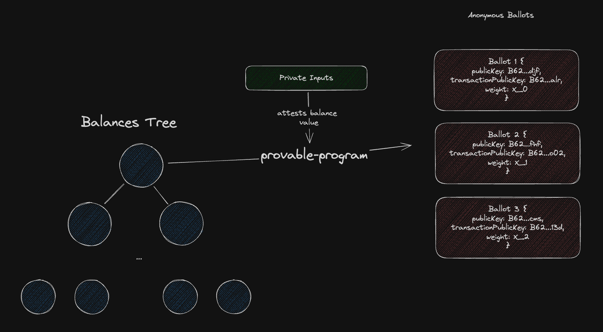

# Anon-Ballots Creation

This is an example (likely over engineered) of how to use a merkle tree of balances and mint anon ballots in a Protokit `runtimeModule`. Note, the voting weight is not encrypted and while the ballots live at anonymous addresses it is still possible to view which transaction they were created in and therefore the true privacy is not achieved.

The idea is:
- There exists a `MerkleMap` of `PublicKey`s to `Balances`
- The controller of each `PublicKey` can create three anonymous ballots that
    - Partition the voting power over three ballots
    - Each ballot lives at a unique stealth address
- To vote on something, the user has to "spend" the ballot
    - The ballot is burned and the vote tallied in a single transaction

The below diagram is a quick mental model of how the ballots are created.



**Quick start:**

```zsh
npx degit proto-kit/starter-kit#develop my-chain
cd my-chain
npm install
npm run test:watch
```

